  

<h1 align="center">👋 Привет, я Михаил - аналитик данных с инженерным бэкграундом в нефтегазовой сфере </h1>

  
  
  
 

---

## Обо мне

Я  аналитик данных с сильным инженерным бэкграундом в нефтегазовой отрасли и практическим опытом работы с экспериментальными и техническими данными.

За годы работы я прошел путь от инженера лаборатории, отвечающего за сбор первичных данных и обслуживание оборудования, до ведущего инженера с зонами ответственности в анализе данных, планировании экспериментов, улучшении процессов и координации команды.

Я специализируюсь на:
- сборе, структурировании и анализе данных;
- автоматизации рутинных процессов и отчетности;
- интерпретации результатов и переводе их в практические выводы;
- создании дашбордов и аналитических отчетов;
- поддержке принятия решений на основе данных.

Опыт работы в области нефтегазовых лабораторных исследований помог мне развить сильное аналитическое мышление, внимание к качеству данных и способность работать со сложными предметными областями. Сейчас я сфокусирован на Data Analytics, SQL, Python, статистике, A/B-тестировании и продуктовых/бизнес-метриках.

---

## Технологический стек

### Аналитика данных

### BI и визуализация

### Аналитические навыки
- A/B-тестирование
- Статистический анализ
- Продуктовые и бизнес-метрики
- Исследовательский анализ данных (EDA)
- Разработка дашбордов
- Автоматизация отчетности
- Очистка и предобработка данных
- Визуализация данных

### Дополнительная экспертиза
- Дизайн экспериментов
- Подготовка технических отчетов
- Контроль качества данных
- Инженерные исследовательские процессы
- Автоматизация процессов

---

## Что я умею

- Писать SQL-запросы для извлечения данных, агрегации и расчета метрик;
- Анализировать данные с помощью Python и библиотек Pandas, NumPy;
- Строить дашборды и отчеты в Apache Superset и Yandex DataLens;
- Проводить анализ A/B-тестов и применять статистические методы;
- Работать с бизнес- и продуктными метриками;
- Автоматизировать повторяющиеся процессы в Excel;
- Интерпретировать аналитические результаты и понятно представлять выводы.

---

## Проекты

### 📱 Retention-анализ мобильной игры  
**Задача:** проанализировать удержание пользователей по когортам и выявить динамику возврата игроков по дням жизни.
🎓 [Karpov Courses](https://karpov.courses/analytics)  

**Стек:**

**Что сделано:**
- рассчитан retention по когортам пользователей;
- построена retention heatmap;
- проанализирована динамика удержания по дням жизни;
- сформулированы выводы о поведении игроков.
**Результат:** получена наглядная картина удержания, позволяющая оценить качество раннего пользовательского опыта и выявить точки снижения вовлеченности.

🔗 **Ссылка на проект:** 
[Открыть notebook](https://github.com/Mikel1171/projects/blob/main/retention-analysis/retention.ipynb)

---

### 📊 Анализ A/B-теста акционных предложений  
**Задача:** сравнить контрольную и тестовую группы по ключевым метрикам монетизации и оценить статистическую значимость различий. 🎓 [Karpov Courses](https://karpov.courses/analytics)    

**Стек:**

**Что сделано:**
- рассчитаны CR, ARPU и ARPPU;
- проведен сравнительный анализ распределений;
- выполнена статистическая проверка различий;
- подготовлена интерпретация результатов теста.

**Результат:** сформирован аналитический вывод о влиянии акционного предложения на пользовательское поведение и монетизацию.

🔗 **Ссылка на проект:**
[Открыть notebook](https://github.com/Mikel1171/projects/blob/main/AB_test/AB_test.ipynb)

---

### 📈 Прогнозирование пользовательской активности и нагрузки на серверы  

**Задача:** спрогнозировать изменение активности пользователей на горизонте 30 дней, чтобы оценить будущую нагрузку на инфраструктуру приложения. 🎓 [Karpov Courses](https://karpov.courses/simulator)

**Стек:** 

**Что сделано:**
- выбрана целевая метрика;
- построены дневные временные ряды активности пользователей;
- учтены внешние события через регрессоры: флэшмоб и единичный технический инцидент;
- протестированы несколько моделей прогнозирования (`DLT`, `LGT`, `KTR`);
- проведены backtesting, подбор параметров и сравнение качества моделей по метрикам ошибки;
- дополнительно проверена устойчивость итоговой модели через MCMC-диагностику.

**Результат:** выбрана модель `LGT`, показавшая наилучшее качество на горизонте 30 дней. Получен прогноз нагрузки, который можно использовать для планирования инфраструктурных ресурсов и оценки будущей активности пользователей.

🔗 **Ссылка на проект:**
[Открыть notebook](https://github.com/Mikel1171/projects/blob/main/metrics_forecasting/metrics_forecasting.ipynb)

---
## 📊 Примеры дашбордов

---

## Контакты

- **Email:** topilinmik@gmail.com
- **LinkedIn:** [написать](https://www.linkedin.com/in/michail-topilin/)
- **Telegram:** [написать](https://t.me/makentosh117)

---

